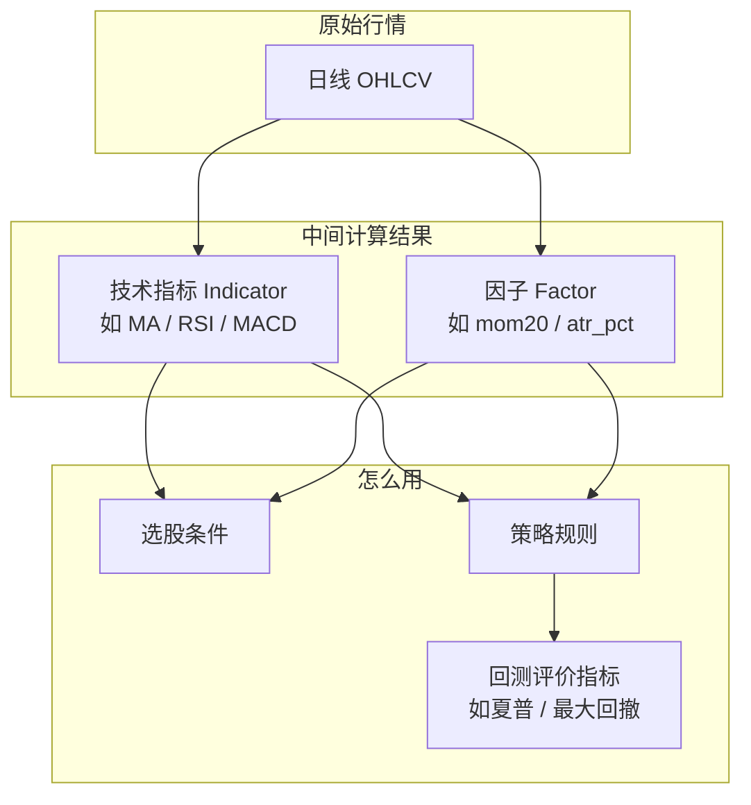
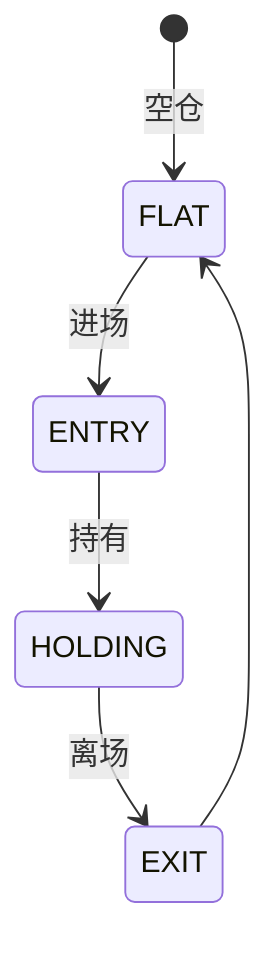
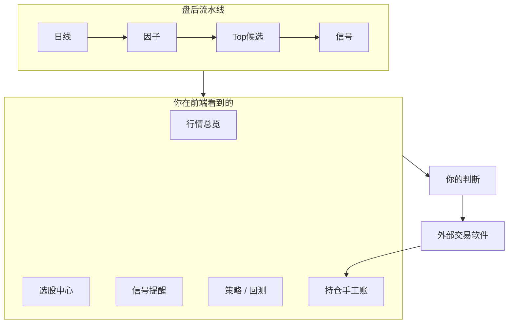
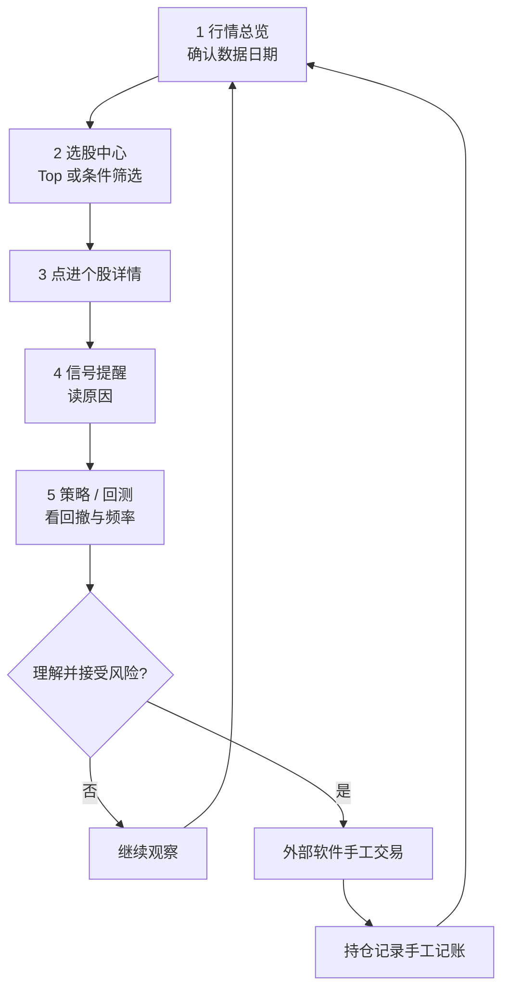

# quant

## A股日频研究决策工作台

把「看行情 → 算指标 → 选股票 → 读策略提示 → 验证历史 → 手工记账」  
串成一条**可理解、可追溯**的研究流程

<div class="pt-6">

</div>

<div class="pt-4 text-sm opacity-70">

面向个人投资者 · 金融小白友好 · 绝不自动下单

</div>

---
layout: default
---

# 今天你会带走什么

| 问题 | 你会理解 | 对应界面 |
|---|---|---|
| 这是什么系统？ | 日频**研究工作台**，不是交易软件 | 登录页底部声明 |
| 打开后先看哪？ | **行情总览**确认数据日期 | 左侧「行情总览」 |
| 指标 / 因子是什么？ | 词典里有中文解释与限制 | **研究词典** |
| 策略怎么配？ | 进场 + 离场 + 验证的完整规格 | **策略管理** |
| 历史靠不靠谱？ | 回测看收益也看**回撤** | **回测验证** |
| 我该怎么用？ | 研究 → 自决 → 外部下单 → 手工记账 | 侧栏「今日研究提示」 |

---
layout: section
---

# 第一部分

## 这是什么 · 先看一眼界面

---
layout: two-cols
---

# 登录页：产品边界写在脸上

系统入口就会提醒：

- 日频研究
- 模拟回测
- 手工记账
- **不连接券商、不提交订单**

> 后面所有「信号 / 提示」  
> 都要按这句话理解。

::right::


---

# 一句话定位

> **用 A 股「每天一根 K 线」的数据，帮你做研究与决策支持；  
> 真实买卖永远由你在外部软件里手工完成。**

<br>

- **日频**：按交易日收盘后思考，不做秒级高频
- **研究**：解释「为什么这只票出现在列表里」
- **决策支持**：候选、提示、历史模拟，**不替你下单**
- **可追溯**：每条结果都能追到数据日期、条件、策略规则

---

# 产品边界（请先记住）

| 系统会做 | 系统绝不做 |
|---|---|
| 采集日线、估值、财务快照 | 连接券商 API |
| 计算技术指标与因子 | 提交真实订单 |
| 条件选股、每日 Top 30 | 自动 / 半自动交易 |
| 策略信号与研究计划 | 暗示「跟单必赚」 |
| 历史回测与参数实验 | 预测明天必涨 |
| 手工记账 | 把信号当成买卖指令 |

<div class="mt-4 p-3 rounded bg-red-500/10 border border-red-500/30 text-sm">

⚠️ 「持仓记录」里的成交 = **你在外部软件做完后自己记的账**，不是系统下的单。

</div>

---
layout: section
---

# 第二部分

## 界面导览 · 跟着侧栏走一遍

---
layout: two-cols
---

# 行情总览 = 每日起点

打开后先看四件事：

1. **研究基准日期**（数据是哪一天的）
2. **数据信任**条（覆盖率、估值/财务是否完整）
3. **自选行情**（你关注的票）
4. **系统候选 Top**（盘后打分选出的）

左下「今日研究提示」给出推荐顺序：  
确认数据 → 看候选 → 读信号 → 回测 → 自行决定。

::right::


---
layout: two-cols
---

# 自选股

- 只维护你关心的代码
- 盘中价格**仅展示**
- 策略与回测仍用**日线收盘**口径

适合：每天盯 5～20 只，  
对照信号页是否触发提示。

::right::


---
layout: two-cols
---

# 选股中心

两条常用路径：

**A. 系统候选**  
盘后自动 Top 列表（动量等因子打分）

**B. 条件筛选**  
自己组合：趋势、估值、财务、行业…

每只票要能说清：  
**命中了什么条件、用哪天的数据。**

::right::


---
layout: two-cols
---

# 股票池 = 「在哪里玩」

策略和选股都要限定宇宙：

- 全部 A 股
- 沪深300 / 中证500
- 自定义池

回测时尽量用**历史成分**，  
避免「用今天的成分回测过去」。

::right::


---
layout: two-cols
---

# 信号提醒

| 标签 | 含义 |
|---|---|
| 入场提示 | 模拟：空仓 → 持有 |
| 退出提示 | 模拟：持有 → 空仓 |
| 临近触发 | 接近条件，尚未变化 |

<div class="mt-3 text-sm opacity-80">

界面文案写得很清楚：  
**「状态变化，不是交易指令」**

</div>

::right::


---
layout: two-cols
---

# 策略管理

左侧：公共策略 + 我的策略  
右侧：完整规格

你会看到：

- 策略类型（单标的 / 组合）
- 证据状态（未验证 / …）
- 股票池、研究假设
- 来源书籍 / 候选 ID

公共策略只读 → **另存为** 后可改。

::right::


---
layout: two-cols
---

# 回测验证

历史**模拟**成交与净值：

- 区间总收益 / 年化
- **最大回撤**（先看这个）
- 夏普、胜率、交易次数
- 成交明细与退出原因

默认语义：  
**T 日收盘出信号 → T+1 开盘模拟成交**

好看 ≠ 明天能赚。

::right::


---
layout: two-cols
---

# 试验账本 & 策略比较

**试验账本**：同一策略改参数族，  
失败结果也归档，不偷偷删。

**策略比较 / 排行**：  
横向看谁回撤小、谁交易太频繁。

适合：参数扫描后防止「只挑最好那组」。

::right::


---
layout: two-cols
---

# 持仓记录 = 手工账本

- 在券商 App 买卖完成
- 回到这里**手工登记**
- 方便复盘，不是下单通道

<div class="mt-4 p-3 rounded bg-amber-500/10 border border-amber-500/30 text-sm">

和「信号提示」是两条线：  
信号 = 研究；账本 = 真实行为记录。

</div>

::right::


---
layout: two-cols
---

# 研究词典 · 最该常开的页

每个指标 / 因子固定四类说明：

1. **中文名**（日常阅读）
2. **英文 key**（对照系统参数）
3. **数值怎么理解**
4. **使用限制**（防误读）

标签页：指标 · 算法模板 · 信号

::right::


---
layout: two-cols
---

# 个股详情

从候选 / 自选点进去：

- 价格与 K 线上下文
- 因子 / 指标数值
- 相关策略状态

研究时尽量回答：  
「为什么今天出现在列表里？」

::right::


---
layout: two-cols
---

# 定时任务（管理员）

生产环境每晚流水线：

日线 → 因子 → Top 候选 → 信号 → …

本地开发默认**不启调度**；  
管理员可在此查看与手工触发。

::right::


---
layout: section
---

# 第三部分

## 零基础术语 · 对着词典学

---

# 三个最容易混的词



**口诀**：指标/因子 = 从价格算出来的「特征」；策略 = 用特征做「如果…就…」；回测指标 = 评价策略历史表现。

---
layout: two-cols
---

# ① 技术指标

**定义**：用一段时间价格/成交量算出来的**图表工具**。

| key | 中文 |
|---|---|
| `ma` | 简单移动平均线 |
| `ema` | 指数移动平均线 |
| `macd` | MACD |
| `rsi` | 相对强弱 RSI |
| `atr` | 平均真实波幅 |

限制：均线**滞后**；RSI 不能把 70/30 机械当买卖点。

::right::


<div class="text-xs opacity-60 mt-2 text-center">研究词典 · 指标页实拍</div>

---

# 指标举例：双均线

```text
5 日均线  = 最近 5 个交易日收盘价平均（更敏感）
20 日均线 = 最近 20 个交易日收盘价平均（更稳）

5 日 > 20 日  → 短线相对中期偏强
5 日 ≤ 20 日  → 短线相对中期偏弱
```

- 这是**描述**，不是保证赚钱的公式  
- 震荡市可能频繁交叉 → 假信号多  
- 系统预置：**双均线趋势策略**（`ma_cross`）

---

# ② 因子（Factor）

**定义**：把价格变化**标准化成可筛选、可打分的字段**，按交易日落库。

| key | 中文 | 白话 |
|---|---|---|
| `mom20` | 近20日涨跌幅 | 近一个月强弱 |
| `mom60` | 近60日涨跌幅 | 近一季强弱 |
| `rsi14` | RSI 14 | 近两周涨跌力度 |
| `ma20_slope` | 20日均线斜率 | 中期均线是否向上 |
| `atr_pct` | 波动幅度% | 晃动大不大 |
| `vol_ratio5` | 量比(5日) | 放量还是缩量 |
| `amount_avg20` | 20日均成交额 | 好不好成交 |

**高动量 ≠ 一定继续涨。**

---

# 指标 vs 因子

| | 技术指标 | 因子 |
|---|---|---|
| 场景 | K 线画图 | 全市场排序、打分 |
| 形态 | 一条时间序列 | 某日一个数 |
| 例子 | MA20、MACD | mom20、atr_pct |
| 本系统 | 策略表达式可调用 | 每日入库供选股 |

```text
收盘价 ──► MA(20)                    ──► 指标
       └──► close_t/close_t-20 - 1   ──► 因子 mom20
```

---

# ③ 估值与财务字段

| 类别 | 例子 |
|---|---|
| 估值 | PE(TTM)、PB、PS、总市值 |
| 盈利 | ROE、毛利率、净利率 |
| 成长 | 营收/利润同比 |
| 风险 | 资产负债率 |

这些来自**外部快照**，不是 K 线推出来的。  
行业差异大：银行负债率不能和制造业直接比。

---

# ④ 回测评价指标

| key | 中文 | 怎么读 |
|---|---|---|
| `total_return` | 区间总收益率 | 这段模拟赚/亏多少 |
| `annual_return` | 年化收益率 | 短区间易被放大 |
| `max_drawdown` | **最大回撤** | 从高点到低点最惨跌幅 |
| `sharpe` | 夏普比率 | 单位波动换收益 |
| `win_rate` | 盈利交易占比 | 高胜率仍可能总亏 |
| `trade_count` | 成交次数 | 是否太频繁、费太高 |

<div class="mt-3 p-3 rounded bg-amber-500/10 border border-amber-500/30 text-sm">

历史模拟 **≠** 未来收益。

</div>

---
layout: section
---

# 第四部分

## 策略是什么

---
layout: two-cols
---

# 策略 = 完整规则，不是荐股清单

必须同时有：

1. **在哪里选** — 股票池  
2. **何时进** — 进场条件  
3. **拿多少** — 仓位 / 权重  
4. **何时出** — 原生离场  
5. **如何保护** — 可选止损止盈  
6. **如何模拟成交** — 默认 T+1  
7. **如何验证** — 基线 / 样本外 / 否决  

只有进场没有离场 = 半成品，不能当真回测。

::right::


---

# 两种策略形态

| 类型 | 像什么 | 预置例子 |
|---|---|---|
| **单标的** | 盯一只：进 / 持 / 出 | 双均线、突破、超跌反弹、放量突破 |
| **组合** | 一篮子：定期调仓 | 强势轮动、多指标评分持有 |



---

# 六个系统预置策略

| 名称 | 类型 | 核心直觉 |
|---|---|---|
| 双均线趋势 | 单标的 | 短均线在长均线上方 → 跟随 |
| 价格突破 | 单标的 | 收盘创新高 → 可能延续 |
| 上升趋势中的超跌反弹 | 单标的 | 大趋势向上 + RSI 偏低 |
| 缩量整理后的放量突破 | 单标的 | 整理后放量向上 |
| 强势股票轮动 | 组合 | 每周持有动量强的一篮子 |
| 多指标综合评分持有 | 组合 | 每月按综合分持有 Top N |

界面里证据状态多为「未验证」——诚实默认，等你自己回测。

---

# 三类离场要分开看

| 类型 | 含义 | 例子 |
|---|---|---|
| **原生离场** | 假设本身失效 | 均线死叉、跌破平台 |
| **风险覆盖** | 路径保护 | 8% 止损、2×ATR |
| **强制/运营** | 资格变化 | ST、调出成分股 |

研究时问：这次亏是因为**假设错了**，还是**风控砍仓**，还是**卖不出**？

---
layout: two-cols
---

# 信号 ≠ 下单

正确心态：

1. 系统出现「入场提示」→ **研究输入**  
2. 我是否接受风险 → **我的决策**  
3. 券商软件点买入 → **外部执行**  
4. 回系统记一笔 → **手工账本**

::right::


---
layout: section
---

# 第五部分

## 业务架构 · 系统怎么转起来

---

# 业务全景（用户视角）



---

# 分层架构（工程视角）

```text
┌─────────────────────────────────────────────┐
│  前端 web/  行情/选股/信号/策略/回测/词典      │
└────────────────────┬────────────────────────┘
                     │ REST + JWT
┌────────────────────▼────────────────────────┐
│  API  薄控制器 → 领域模块                      │
│  data · strategy · backtest · selection …   │
└────────────────────┬────────────────────────┘
                     ▼
              MySQL  quant_* 表
```

策略定义存在数据库 `quant_strategy.spec`，  
不是每来一个想法就新建一个 Python 文件。

---

# 数据生命周期

| 类别 | 例子 | 会不会改写 |
|---|---|---|
| **原始事实** | 不复权收盘、复权因子、日历 | 原则上不改 |
| **外部版本指标** | 估值/财务快照 | 按版本追加 |
| **派生视图** | 前复权价、因子、候选、信号 | 可重算 |
| **用户数据** | 自选、手工成交、自定义策略 | 用户改 · **最该备份** |

---

# 选股两条路径

### A · 每日 Top（自动化）

过滤 ST / 停牌 / 上市过短 / 流动性  
→ 动量等因子截面打分 → 系统候选

### B · 条件筛选（交互）

研究词典里的字段都能组合：  
技术因子 · 行情 · 估值财务 · 行业

支持 AND/OR；**自然语言选股尚未实现**。

---
layout: two-cols
---

# 每晚流水线（生产）

```text
16:30  串行作业
  ├─ 日线增量
  ├─ 因子计算
  ├─ Top 候选
  ├─ 策略信号
  └─ 周五：批量评估

盘中  自选快照（仅展示）
18:30  估值快照
```

管理员在「定时任务」页可见运行历史。

::right::


---

# 回测撮合固定语义

```text
StrategySpec ──编译──► 逐日目标仓位
                         │
                         ▼
              T 收盘信号 · T+1 开盘成交
              涨跌停 / 停牌 → 归因
              佣金 · 印花税 · 滑点
                         │
                         ▼
              净值 · 交易 · 退出原因 · 否决
```

**新策略只改「仓位怎么来」，不另起成交时钟。**

---

# 证据状态机

```text
unverified → design_complete → backtested → oos_passed
                                              ↑
                         任一否决 / 人工否决 → rejected
```

- `oos_passed` 仍只是**研究结论**  
- 本系统没有「上线自动交易」一说  
- 改策略身份字段 → 证据可能回退

---
layout: section
---

# 第六部分

## 推荐用法 · 一日研究闭环

---

# 跟着侧栏做一遍



---
layout: two-cols
---

# 界面 ↔ 闭环对照

| 步骤 | 点哪里 |
|---|---|
| 确认数据 | 行情总览 |
| 找候选 | 选股中心 |
| 读原因 | 个股详情 / 信号 |
| 验证历史 | 回测验证 |
| 查名词 | 研究词典 |
| 记真实成交 | 持仓记录 |

::right::


---

# 金融小白最容易踩的坑

| 误区 | 更正确的理解 |
|---|---|
| 回测年化 50% → 明年也能 | 过拟合与区间运气很常见 |
| 高胜率 = 好策略 | 可能小赚大亏 |
| 因子高 = 该买 | 要有完整进出场规则 |
| 信号 = 下单指令 | 信号是研究状态变化 |
| 忽略涨跌停 / 停牌 | A 股买不进卖不出是常态假设 |

---

# 设计原则

1. **中文优先**，英文 key 作专业补充  
2. **先解释再行动**（词典限制字段）  
3. **新手默认，专业可展开**  
4. **结果可追溯**  
5. **研究与交易严格分离**

品牌气质：**清晰、克制、可信**。

---
layout: section
---

# 附录

## 速查

---

# 概念速查卡

| 概念 | 一句话 | 界面 |
|---|---|---|
| 日线 | 每个交易日一根 K | 个股详情 |
| 技术指标 | MA/RSI/MACD 等 | 研究词典·指标 |
| 因子 | 可排序打分的日频特征 | 选股 / 候选评分 |
| 股票池 | 策略宇宙 | 股票池 |
| 策略 | 进+持+出+验证 | 策略管理 |
| 信号 | 模拟状态变化提示 | 信号提醒 |
| 回测 | 历史模拟成绩单 | 回测验证 |
| 手工账 | 外部真实成交记录 | 持仓记录 |

---

# 本地与线上

```bash
# 本地
make quant           # API :8100
make quant-web       # 看板
make quant-slidev    # 本幻灯片 :3030

# 线上部署
make deploy-quant          # 业务系统 :8100
make deploy-quant-slidev   # 本幻灯片 :3030
```

---
layout: center
class: text-center
---

# 记住三句话

### 1. 这是**研究工作台**，不是交易机器人  
### 2. **指标 / 因子** 是特征，**策略** 才是完整规则  
### 3. 真实买卖 **由你在外部确认并执行**

<div class="pt-8">

</div>

---
layout: center
class: text-center
---

# 谢谢

## 下一步

打开线上 quant → 研究词典读完 **MA** 与 **mom20** 的限制  
→ 行情总览确认数据日期  
→ 选股中心看 3 只候选并点进详情  
→ 对「双均线」跑一段短回测，**只盯最大回撤与交易次数**

<div class="pt-8 text-xs opacity-50">

截图来自生产界面说明用途 · 不构成投资建议  
口径以 README / PRODUCT / catalog 为准

</div>
