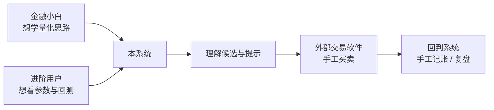
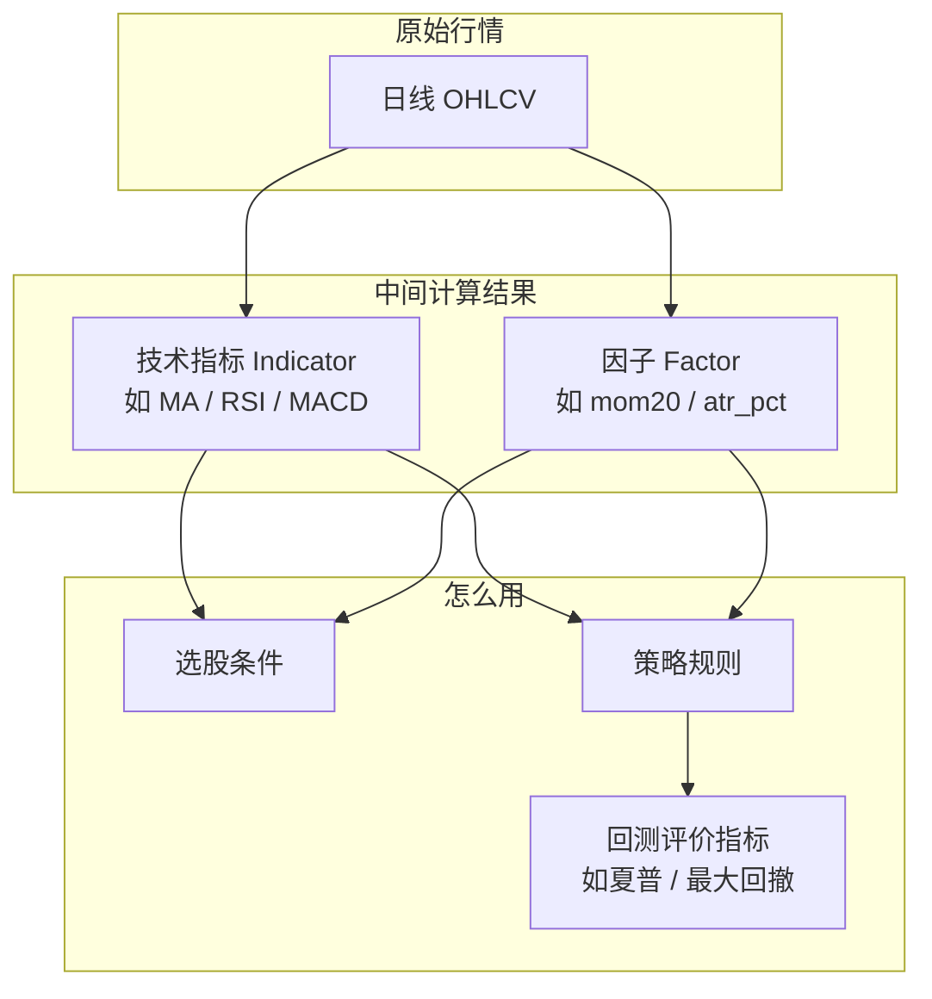
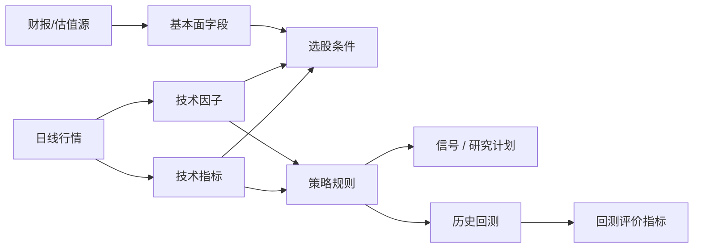
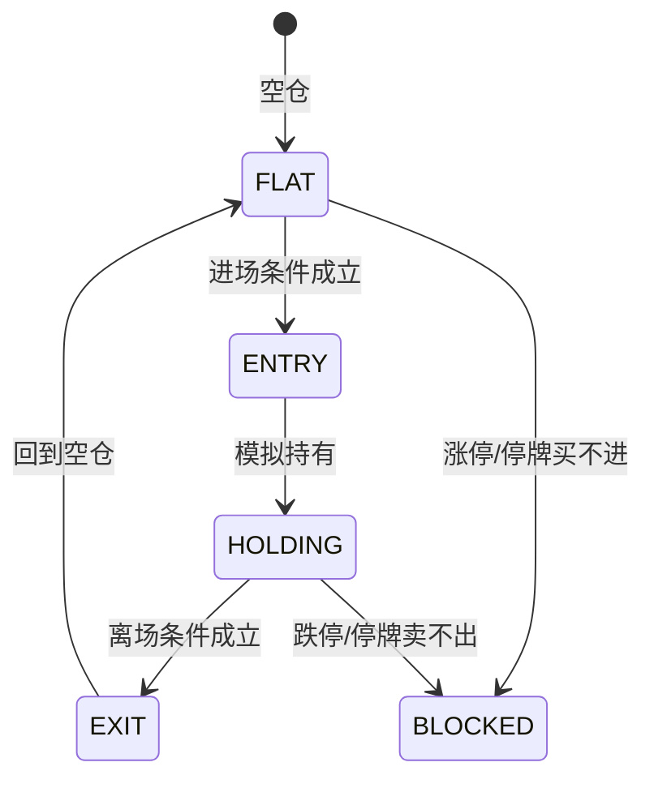
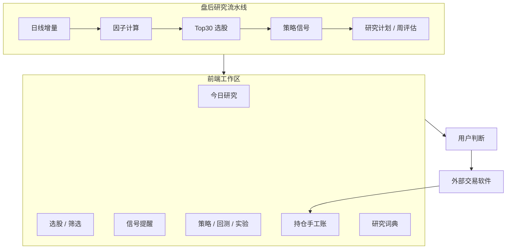
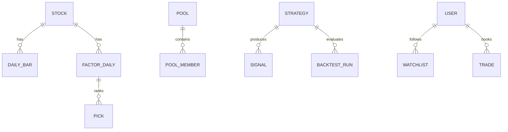
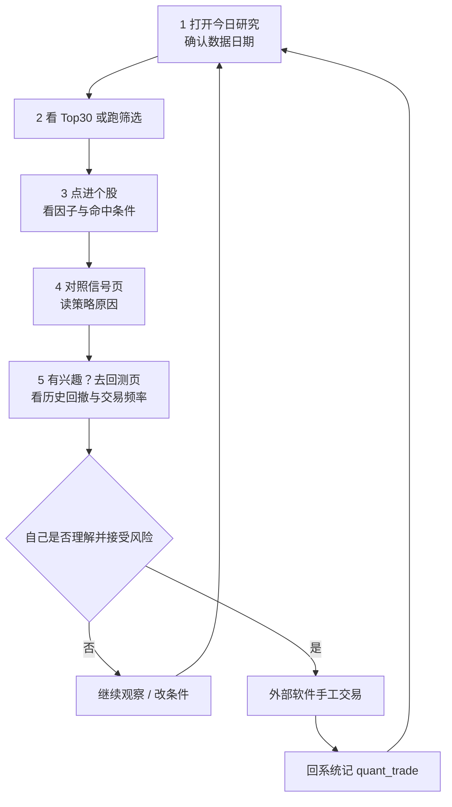

# quant

## A股日频研究决策工作台

把「看行情 → 算指标 → 选股票 → 读策略提示 → 验证历史 → 手工记账」  
串成一条**可理解、可追溯**的研究流程

<div class="pt-8 text-sm opacity-70">

面向个人投资者 · 金融小白友好 · 绝不自动下单

</div>

---
layout: default
---

# 今天你会带走什么

| 问题 | 你会理解 |
|---|---|
| 这是什么系统？ | 日频**研究与决策支持**，不是交易软件 |
| 能帮我做什么？ | 看数据、筛股票、读提示、做回测、记手工账 |
| 不能做什么？ | 连接券商、提交订单、自动/半自动交易 |
| 指标 / 因子 / 策略？ | 三者各是什么、如何拼在一起 |
| 系统怎么运转？ | 业务分层、数据链路、每晚流水线 |
| 我该怎么用？ | 推荐的日常研究闭环 |

---
layout: section
---

# 第一部分

## 这是什么 · 不是什么

---

# 一句话定位

> **用 A 股「每天一根 K 线」的数据，帮你做研究与决策支持；  
> 真实买卖永远由你在外部软件里手工完成。**

<br>

- **日频**：按交易日收盘后思考，不看秒级盘口、不做高频
- **研究**：解释「为什么这只票出现在列表里」
- **决策支持**：给候选、提示、历史模拟，**不替你下单**
- **可追溯**：每条结果都能追到数据日期、条件、策略规则

---

# 产品边界（请先记住）

| 系统会做 | 系统绝不做 |
|---|---|
| 采集日线、估值、财务快照 | 连接券商 API |
| 计算技术指标与因子 | 提交真实订单 |
| 条件选股、每日 Top 30 | 自动 / 半自动交易 |
| 策略信号与研究计划 | 暗示「跟单必赚」 |
| 历史回测与参数实验 | 预测明天必涨 |
| 手工记账 `quant_trade` | 把信号当成买卖指令 |

<div class="mt-6 p-4 rounded bg-red-500/10 border border-red-500/30 text-left text-sm">

⚠️ **`quant_trade` 只是你自己记的外部成交账本**，不是系统生成的订单。

</div>

---

# 主要用户是谁



- 默认路径：**中文优先**、先解释再行动
- 专业路径：同一套能力可展开参数、表达式、证据状态
- **不维护两套产品**——新手默认，专业可钻

---
layout: section
---

# 第二部分

## 零基础术语课

---

# 从一张「日线」说起

一只股票**每个交易日**有一根日 K（OHLCV）：

| 字段 | 白话 |
|---|---|
| open / high / low / close | 开、高、低、收 |
| volume / amount | 成交量、成交额 |
| raw_close | **不复权**收盘价（原始事实） |
| open…close（本系统主用） | **前复权**价（方便跨分红比较） |

<div class="mt-4 text-sm opacity-80 text-left">

- **前复权**：把历史价格按分红送转「对齐」到今天，方便算涨跌幅和均线  
- 副作用：分红后上游可能**重写**历史前复权价 → 本系统用复权因子表 + 重锚检测处理  
- **盘中快照**只用于页面展示和持仓估值，**不参与**策略与回测

</div>

---

# 三个最容易混的词



**口诀**：指标/因子 = 从价格算出来的「特征」；策略 = 用特征做「如果…就…」；回测指标 = 评价策略历史表现。

---

# ① 技术指标（Indicator）

**定义**：用一段时间价格/成交量算出来的**图表工具**，描述趋势、强弱、波动。

| 系统内 key | 中文名 | 一句话 |
|---|---|---|
| `ma` | 简单移动平均线 | 最近 N 日收盘价的平均 |
| `ema` | 指数移动平均线 | 更看重最近价格的均线 |
| `macd` | MACD | 快慢均线之差，看动量变化 |
| `rsi` | 相对强弱 RSI | 0–100，比涨跌力度 |
| `atr` | 平均真实波幅 | 价格「晃得多大」 |
| `volume_ratio` | 量比（日频） | 今日量相对近几日均量 |

<div class="mt-4 text-sm opacity-70">

限制：均线/MACD **滞后**；RSI 不能把 70/30 机械当买卖点；本系统量比为**日频**，≠ 行情软件盘中量比。

</div>

---

# 指标举例：双均线

```text
5 日均线  = 最近 5 个交易日收盘价的平均（更敏感）
20 日均线 = 最近 20 个交易日收盘价的平均（更稳）

若 5 日均线  > 20 日均线  → 短线相对中期偏强（金叉附近）
若 5 日均线  ≤ 20 日均线  → 短线相对中期偏弱（死叉附近）
```

- 这是**描述**，不是保证赚钱的公式  
- 震荡市可能「频繁交叉」→ 假信号多  
- 系统里对应预置策略：**双均线趋势策略**（`ma_cross`）

---

# ② 因子（Factor）

**定义**：把指标或价格变化**标准化成可筛选、可打分的字段**，通常按交易日落库。

本系统每日因子表 `quant_factor_daily` 核心字段：

| key | 中文 | 类别 | 白话 |
|---|---|---|---|
| `mom20` | 近20日涨跌幅 | 趋势与动量 | 近一个月左右强弱 |
| `mom60` | 近60日涨跌幅 | 趋势与动量 | 近一季强弱 |
| `rsi14` | RSI 14 | 趋势与动量 | 近两周涨跌力度 |
| `ma20_slope` | 20日均线斜率 | 趋势与动量 | 中期均线是否向上 |
| `atr_pct` | 波动幅度% | 风险与波动 | 晃动大不大 |
| `vol_ratio5` | 量比(5日) | 成交与流动性 | 放量还是缩量 |
| `amount_avg20` | 20日均成交额 | 成交与流动性 | 好不好成交 |

<div class="mt-3 text-sm opacity-70">

因子告诉你「这只票在截面上处于什么位置」；**高动量 ≠ 一定继续涨**。

</div>

---

# 指标 vs 因子（对比记忆）

| | 技术指标 | 因子 |
|---|---|---|
| 常见场景 | K 线图上画线 | 全市场排序、打分、筛选 |
| 形态 | 一条时间序列曲线 | 往往是「某日一个数」 |
| 例子 | MA20、MACD 柱 | mom20、atr_pct |
| 在本系统 | 策略表达式可调用 `ma`/`rsi`… | 每日计算入库，供选股/打分 |
| 共同点 | 都来自日线（及少量量价） | 都是**派生数据**，可重建 |

```text
收盘价序列 ──► MA(20)  ──► 指标（画图 / 条件）
          └──► (close_t / close_t-20 - 1) ──► 因子 mom20（打分）
```

---

# ③ 基本面与估值「字段」（也常被叫指标）

这些**不是**从 K 线推出来的技术指标，而是外部数据源的**版本化快照**：

| 类别 | 例子 | 白话 |
|---|---|---|
| 估值 | PE(TTM)、PB、PS、总市值 | 贵不贵、公司规模 |
| 盈利质量 | ROE、毛利率、净利率、现金流/利润 | 赚钱质量如何 |
| 成长 | 营收同比、利润同比 | 增长快不快 |
| 财务风险 | 资产负债率 | 杠杆高不高 |

<div class="mt-4 text-sm opacity-80 text-left">

- 存于 `quant_valuation_snapshot` / `quant_fundamental_snapshot`  
- 用「快照」是为了：**财报修订、公告时点**不会让历史研究「看见未来」  
- 行业差异极大：银行的负债率不能和制造业直接比

</div>

---

# ④ 回测评价指标（Metrics）

**定义**：策略在历史模拟跑完后，用来**打分的成绩单**（评价策略，不是评价单只股票当天）。

| key | 中文 | 怎么读 |
|---|---|---|
| `total_return` | 区间总收益率 | 这段时间模拟赚/亏多少 |
| `annual_return` | 年化收益率 | 折算成一年大概多少（短区间易放大） |
| `max_drawdown` | 最大回撤 | 从高点到低点最惨跌了多少 |
| `sharpe` | 夏普比率 | 单位波动换来的收益（本系统未扣无风险利率） |
| `win_rate` | 盈利交易占比 | 赚的笔数占比（高胜率仍可能总亏） |
| `trade_count` | 成交次数 | 交易是否太频繁（费高） |

<div class="mt-3 p-3 rounded bg-amber-500/10 border border-amber-500/30 text-sm">

历史模拟 **≠** 未来收益。回测好看只是「值得继续研究」的证据之一。

</div>

---

# 术语总表（一张图搞定）



| 中文口语 | 本系统更精确的说法 |
|---|---|
| 「这个指标怎么样」 | 技术指标 / 因子 / 估值字段，要分清 |
| 「策略信号」 | 模拟持有状态变化提示，非下单 |
| 「收益率」 | 回测区间指标，或真实手工账，勿混 |

---
layout: section
---

# 第三部分

## 策略是什么

---

# 策略 = 可检验的「如果…那么…」

**策略不是「推荐股票清单」**，而是一套完整规则：

1. **在哪里选** —— 股票池（如全部 A 股、沪深300）
2. **何时进场** —— 条件成立（如突破 20 日高点）
3. **拿多少** —— 仓位或组合权重
4. **何时离场** —— 原生假设失效（如跌破 10 日低点）
5. **如何保护** —— 可选止损/止盈覆盖层
6. **如何成交（模拟）** —— 默认 **T 日收盘算信号，T+1 开盘模拟成交**
7. **如何验证** —— 基线对比、样本外、否决条件

<div class="mt-4 text-sm opacity-70">

半成品（只有进场没有离场）在本系统里会能力校验失败，不能当作可回测策略。

</div>

---

# 两种策略形态

| 类型 | kind | 像什么 | 预置例子 |
|---|---|---|---|
| **单标的** | `single` | 盯一只：进 / 持 / 出 | 双均线、突破、超跌反弹、放量突破 |
| **组合** | `portfolio` | 一篮子：定期调仓 | 强势轮动、多指标评分持有 |



---

# 三类「离场」要分开看

| 类型 | 含义 | 例子 |
|---|---|---|
| **原生离场** | 策略假设本身失效 | 均线死叉、跌破平台下沿 |
| **风险覆盖** | 路径保护，不否定假设 | 固定 8% 止损、2×ATR 止损 |
| **强制/运营** | 资格变化 | 变成 ST、调出成分股、缺数据 |

研究时请问：这次亏钱是因为**假设错了**，还是因为**风控砍仓**，还是因为**买不进/卖不出**？

---

# 六个系统预置策略

| 名称 | 类型 | 核心直觉 |
|---|---|---|
| 双均线趋势 | 单标的 | 短均线在长均线上方 → 趋势跟随 |
| 价格突破 | 单标的 | 收盘创新高 → 可能延续；跌破短期低点退出 |
| 上升趋势中的超跌反弹 | 单标的 | 大趋势向上 + RSI 偏低 → 观察修复 |
| 缩量整理后的放量突破 | 单标的 | 整理收敛后放量向上 |
| 强势股票轮动 | 组合 | 每周持有动量强的一篮子 |
| 多指标综合评分持有 | 组合 | 每月按综合分持有 Top N |

所有策略默认：`exclude_st`、最少上市天数、A 股日频成本模型；证据状态初始多为 `unverified`。

---

# 策略规格 StrategySpec（唯一事实来源）

策略存在数据库 `quant_strategy.spec` 的 JSON 里，**不是**为每个想法新建一个 Python 文件。

```text
StrategySpec
├── metadata     假说、来源书、证据状态
├── universe     股票池、排除 ST、流动性门槛
├── data_requirements  需要 close/high/volume…
├── entry        进场布尔表达式
├── native_exit  原生离场表达式
├── positioning / rebalance  仓位或组合调仓
├── overlays     风险 / 止盈覆盖层
├── execution    T 收盘信号 → T+1 开盘成交
└── validation   基线、锁定样本外、否决规则
```

表达式是**受控 AST**（白名单算子），禁止 `eval` 任意代码。

---

# 信号 ≠ 下单指令

| side | 中文 | 含义 |
|---|---|---|
| `buy` | 入场提示 | 模拟状态：未持有 → 持有 |
| `sell` | 退出提示 | 模拟状态：持有 → 未持有 |
| `watch` | 临近触发 | 接近条件，尚未变化 |
| `add` / `reduce` | 加/减仓提示 | 目标仓位档位变化（若启用） |

<div class="mt-6 p-4 rounded bg-cyan-500/10 border border-cyan-500/30 text-sm text-left">

正确心态：  
「系统说今天出现了入场提示」= **研究输入**  
「我是否明天开盘买」= **我的决策**  
「我在券商软件点买入」= **外部执行**  
「回来记一笔 quant_trade」= **手工账本**

</div>

---
layout: section
---

# 第四部分

## 业务架构

---

# 业务全景（用户视角）



---

# 分层架构（工程视角）

```text
┌──────────────────────────────────────────────────────────┐
│  前端 web/  Vue3 · 今日研究 / 选股 / 信号 / 策略 / 回测     │
└────────────────────────────┬─────────────────────────────┘
                             │ REST + JWT
┌────────────────────────────▼─────────────────────────────┐
│  API  app/api/  薄控制器，业务下沉到领域模块                 │
└────────────────────────────┬─────────────────────────────┘
      ┌──────────────────────┼──────────────────────┐
      ▼                      ▼                      ▼
  数据 app/data/      策略 app/strategy/      回测 app/backtest/
  采集·复权·质量       Spec·编译·信号·证据      引擎·验证·实验
      │                      │                      │
      └──────────────────────┼──────────────────────┘
                             ▼
              MySQL  quant_* 表（与主站共用库，前缀隔离）
```

---

# 数据生命周期（为什么要分层）

| 类别 | 例子 | 会不会被改写 | 备份价值 |
|---|---|---|---|
| **原始事实** | raw_close、复权因子、交易日历 | 原则上不改 | 高 |
| **外部版本指标** | 估值/财务快照 | 按版本追加 | 中 |
| **派生视图** | 前复权 OHLC、因子、选股、信号、回测 | 可重算 | 低 |
| **用户数据** | 自选、手工成交、自定义池/策略 | 用户改 | **最高** |

实践：**派生数据坏了就重算**；用户那几 KB 账本反而最该保护。

---

# 数据从哪来

| 数据 | 主来源 | 说明 |
|---|---|---|
| 沪深日线（前复权） | baostock 批量接口 | 全市场按日拉取，避免按股票循环打爆限额 |
| 复权因子 | baostock | 稀疏按除权日存储 |
| 北交所日线 | akshare（新浪） | baostock 不覆盖，可信度标注较低 |
| 盘中快照 | akshare | 仅展示/估值，不进策略 |
| 估值 PE/PB… | 东财等 | 日频快照 |
| 财务 ROE… | 定期批量 | 带 report_period / available_date |

**baostock 硬限制（按出口 IP）**：≤5 万次/日；**禁止并发连接**；超限可能进黑名单。

---

# 核心业务对象地图



| 对象 | 表 | 作用 |
|---|---|---|
| 股票 / 日线 | `quant_stock` / `quant_daily_bar` | 研究的地基 |
| 池 | `quant_pool` (+ member) | 策略与选股的宇宙 |
| 因子 / 候选 | `quant_factor_daily` / `quant_pick` | 每日特征与 Top30 |
| 策略 / 信号 | `quant_strategy` / `quant_signal` | 规则与提示 |
| 回测 | `quant_backtest_*` | 历史模拟证据 |
| 手工账 | `quant_trade` | 外部成交记录 |

---

# 股票池（Universe）

预置系统池（不可当「荐股」理解，只是范围）：

| 池 | 含义 |
|---|---|
| 全部 A 股 | 动态解析全市场（常加上市天数门槛） |
| 沪深300 | 大盘蓝筹成分 |
| 中证500 | 中盘成分 |
| 沪深300+中证500 | 常用研究宇宙 |

- 还可建**用户静态池**（自己维护一串代码）  
- 策略 Spec 里的 `universe.pool_id` 决定「在哪玩」  
- 成分历史在 `quant_index_member`，避免用「今天的成分」回测过去

---

# 选股：两条路径

### 路径 A · 每日 Top 30（自动化）

盘后流水线：过滤 ST / 停牌 / 上市过短 / 流动性不足  
→ 动量为主打分（mom20、mom60、ma20_slope）+ 量能确认  
→ 写入 `quant_pick`

### 路径 B · 条件筛选器（交互）

在页面用**结构化条件**组合：

- 技术因子：动量、RSI、均线多头…  
- 行情：涨跌幅、距高点…  
- 估值财务：PE、ROE、负债率…  
- 基础：行业、是否 ST、上市天数  

支持 AND/OR 分组、条件启停、本地方案保存。  
**自然语言选股尚未实现。**

---

# 每晚流水线（生产环境）

```text
16:30  晚间串行作业（保证下游数据完整）
       ├─ 池内 + 自选 日线增量
       ├─ 因子计算 → quant_factor_daily
       ├─ Top30 选股 → quant_pick
       ├─ 信号引擎（自选 + 选股池 × 启用的单标的策略）
       ├─ 组合策略研究计划
       └─ 周五：批量策略评估

盘中  9:30–15:00 每 30 分钟：自选快照（展示用）
18:30  估值快照（交易日）
周六   名录 / 财务等维护任务
每月   交易日历、成分股同步
```

本地开发默认 `env=dev`：**不启调度**，需要时用管理端手工触发，避免抢生产采集锁。

---

# 策略编译与回测撮合

```text
StrategySpec ──编译器──► 逐日目标仓位 / 权重
                              │
                              ▼
                     唯一撮合语义（不可另起炉灶）
                     · 信号：T 日收盘后可知
                     · 成交：最早 T+1 开盘
                     · 涨跌停 / 停牌 / 缺 K 线 → 归因
                     · 佣金、印花税、滑点
                              │
                              ▼
                     净值曲线 + 交易明细 + 退出原因
                              │
                              ▼
                     validation：基线 / 锁定 OOS / 否决
```

**新策略只改「目标仓位怎么来」；不改成交时钟。**

---

# 证据状态机（科学一点）

```text
unverified  ──设计写清──►  design_complete
      │                         │
      │                    跑完样本内回测
      │                         ▼
      │                    backtested
      │                         │
      │              锁定样本外 + 否决规则全过
      │                         ▼
      │                    oos_passed  ← 仍只是研究结论
      │                         │
      └──── 任一否决 / 人工否决 ──► rejected
```

- 改策略身份字段 → 证据可能回退  
- 历史回测保存 **Spec 快照**，改策略不影响旧结果  
- `oos_passed` **≠** 可以上线自动交易（本系统也没有上线交易）

---
layout: section
---

# 第五部分

## 你怎么用 · 前端工作区

---

# 前端页面地图

| 工作区 | 你在干什么 |
|---|---|
| **今日研究** Dashboard | 数据是否就绪、今日候选与状态总览 |
| **选股** Picks / Screener | Top30 或条件筛选，看命中原因 |
| **信号** Signals | 策略提示与临近触发 |
| **策略** Strategies | 读/改 StrategySpec，启停策略 |
| **回测** Backtest | 历史模拟、净值、交易明细 |
| **实验** Experiments | 参数族试验与多重检验 |
| **排行** Leaderboard | 策略评估横向比较 |
| **股票池** Pools | 宇宙范围管理 |
| **自选 / 持仓** | 关注列表与手工账 |
| **研究词典** Catalog | 指标、因子、模板、信号、回测指标的中文说明 |
| **任务 / 管理** | 异步任务、调度作业（管理员） |

---

# 推荐：新手一日研究闭环



---

# 研究词典：所有中文从哪来

后端固定字典 `GET /api/catalog`：

- 因子字段、筛选字段、技术指标  
- 算法模板与参数含义  
- 信号 side、原因类型  
- 回测评价指标  

**约定**：英文 key 是稳定内部 ID；界面展示中文名 + 限制说明。  
策略实例本身**不在** catalog 里——它们是 `quant_strategy` 业务数据。

---

# 从「一本书里的想法」到系统策略

```text
读书 / 想法
   → 写成可检验假说（hypothesis）
   → 在策略页配置 Spec（池、进场、离场、验证）
   → 能力校验 supported
   → 标记 design_complete
   → 回测 + 样本外
   → 参数实验（失败也归档，不删）
   → 证据状态更新
   → 可选：启用，参与每日信号
```

框架目标不是「把某本书写成固定模板上线」，  
而是提供 **可配置、可校验、可回测、可归档** 的验证平台。

---
layout: section
---

# 第六部分

## 风险、误区与原则

---

# 金融小白最容易踩的坑

| 误区 | 更正确的理解 |
|---|---|
| 回测年化 50% → 明年也能 | 过拟合、区间运气、成本低估都很常见 |
| 高胜率 = 好策略 | 可能小赚大亏 |
| 因子高 = 该买 | 因子只是特征，要有完整进出场 |
| 信号 = 下单指令 | 信号是研究状态变化 |
| 用未来数据调参 | 前视偏差；系统尽量用快照与 T+1 成交防住一部分 |
| 忽略流动性与涨跌停 | A 股买不进、卖不出是常态假设 |

---

# 系统层面的诚实约束

1. **日频**：收盘后决策，次日开盘模拟；不适合超短线盘口博弈叙事  
2. **费用与滑点**：回测计入，但仍是模型  
3. **前复权重写**：增量更新有原理风险，靠因子表与检测缓解  
4. **北交所 / 部分源**：覆盖与可信度低于主路径  
5. **节假日**：靠交易日历，无数据则任务自然空跑  
6. **不提供**「一键实盘」任何形态

---

# 设计原则（产品性格）

1. **中文优先**，英文 key 作专业补充  
2. **先解释再行动**  
3. **新手默认，专业可展开**  
4. **结果可追溯**（哪天数据、哪条条件、哪个策略）  
5. **研究与交易严格分离**

品牌气质：**清晰、克制、可信** —— 像研究工具，不像荐股营销页。

---
layout: section
---

# 附录

## 速查

---

# 概念速查卡

| 概念 | 一句话 |
|---|---|
| 日线 | 每个交易日一根 K |
| 前复权 | 为跨分红可比而调整的价格序列 |
| 技术指标 | MA/RSI/MACD 等图表工具 |
| 因子 | 可排序打分的日频特征字段 |
| 估值/财务字段 | 外部快照，非 K 线推导 |
| 股票池 | 策略与选股的宇宙 |
| 策略 | 进场+持有+离场+验证的完整规则 |
| 信号 | 模拟状态变化提示 |
| 回测 | 历史模拟成交与净值 |
| 回测指标 | 收益/回撤/夏普等成绩单 |
| 证据状态 | 假说被验证到哪一步 |
| 手工账 | 外部真实成交的记录 |

---

# 目录结构（给想读代码的人）

```text
quant/
├── app/
│   ├── api/           HTTP 路由
│   ├── data/          采集、日历、质量、股票池解析
│   ├── factors/       日频因子
│   ├── selection/     Top30 与筛选
│   ├── strategy/      Spec、编译、信号、证据、预置
│   ├── backtest/      引擎、验证、作业
│   ├── portfolio/     手工持仓与成交
│   ├── research_plan/ 研究计划
│   └── catalog.py     中文研究词典
├── web/               Vue3 看板
├── sql/init.sql       空库 DDL + 种子策略/池
├── DATA-ARCHITECTURE.md
└── PRODUCT.md
```

---

# 本地快速启动

```bash
# 后端
cd quant && uv sync
uv run uvicorn app.main:app --port 8100 --reload
# Swagger: http://localhost:8100/docs

# 前端
cd quant/web && pnpm install && pnpm dev
# http://localhost:5173  /api → 8100

# 本幻灯片
cd quant/slidev && pnpm install && pnpm dev
```

除健康检查与登录外，业务 API 需要 `Authorization: Bearer <JWT>`。

---
layout: center
class: text-center
---

# 记住三句话

### 1. 这是**研究工作台**，不是交易机器人  
### 2. **指标 / 因子** 是特征，**策略** 才是完整规则  
### 3. 所有真实买卖，**由你在外部确认并执行**

<div class="pt-10 opacity-60 text-sm">

quant · A股日频研究决策工作台 · 仅供信息与模拟

</div>

---
layout: center
class: text-center
---

# 谢谢

## 下一步建议

在「研究词典」里点开任意因子，读完 **含义 + 限制**  
→ 跑一次条件筛选  
→ 打开预置「双均线」看 Spec  
→ 做一段短区间回测，只看**最大回撤**和**交易次数**

<div class="pt-8 text-xs opacity-50">

问题与产品边界以仓库内 `README.md` / `PRODUCT.md` / `AGENTS.md` 为准

</div>
