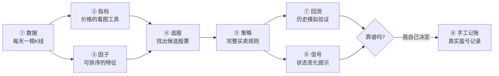
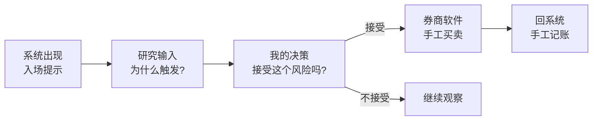
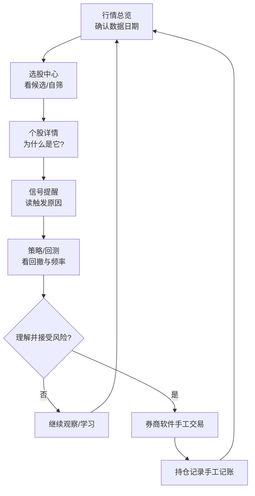

# quant 是什么？

## 一条「量化研究流水线」的小白讲解

今天不讲按钮怎么点，讲**一件事**：

<div class="pt-6 text-left inline-block text-xl leading-relaxed">

一只股票从「一堆行情数字」  
怎么一步步变成「一份有依据的研究结论」

</div>

<div class="pt-6">

</div>

<div class="pt-3 text-sm opacity-70">

面向个人投资者 · 金融小白友好 · 绝不自动下单

</div>

---

# 先立规矩：系统的边界

| 系统会做 | 系统绝不做 |
|---|---|
| 采集行情、算指标因子 | 连接券商、替你下单 |
| 按规则选股、提示信号 | 保证赚钱、预测明天 |
| 用历史数据模拟验证 | 把信号当成买卖指令 |

<div class="mt-6 p-4 rounded bg-red-500/10 border border-red-500/30">

⚠️ 真实买卖永远发生在**你的券商软件**里，系统只是研究助手。

</div>

<div class="pt-4 text-sm opacity-60">

登录页实拍 ↓ 这条声明写在系统入口

</div>


---
layout: section
---

# 今天的主线

## 八个环节，一条链

---

# 主线地图（今天反复回到这张图）



<div class="mt-4 text-left text-sm opacity-80">

**一句话版**：数据是原料，指标/因子把原料加工成「特征」，选股用特征挑股票，
策略用特征定规则，信号是规则的每日状态，回测用历史检验规则，
最后**由你决定**是否真金白银去做，做完回来记账。

</div>

---
layout: section
---

# ① 数据

## 一切的原料：每个交易日一根 K 线

---
layout: two-cols
---

# 什么是日线（K 线）？

每个交易日，每只股票留下 **6 个数字**：

| 字段 | 白话 |
|---|---|
| 开 | 今天第一笔成交价 |
| 高 | 今天最高 |
| 低 | 今天最低 |
| 收 | 今天最后一笔成交价 |
| 量 | 成交多少股 |
| 额 | 成交多少钱 |

一根根 K 线连起来，就是这只股票的**历史**。

本系统是**日频**：收盘后思考，不做秒级高频。

::right::


<div class="text-xs opacity-60 mt-2 text-center">界面辅助：个股详情里的 K 线与历史</div>

---

# 数据从哪来、可不可信？

- **盘后日线**：来自公开数据源，收盘后采集入库
- **盘中价格**：仅展示，不参与策略计算
- **估值 / 财务**：PE、ROE 等外部快照，按版本追加

<div class="mt-4 p-3 rounded bg-amber-500/10 border border-amber-500/30 text-sm">

每天第一件事：确认「**研究基准日期**」——  
你看到的所有结论，都是基于哪一天的数据算出来的。

</div>


<div class="text-xs opacity-60 mt-1 text-center">界面辅助：行情总览顶部的数据日期与信任条</div>

---
layout: section
---

# ② 指标

## 把 K 线变成「看图的辅助线」

---
layout: two-cols
---

# 指标 = 价格算出来的图表工具

**定义**：用一段时间的价格/成交量，算出一条线，帮助人眼判断状态。

| key | 中文 | 白话 |
|---|---|---|
| `ma` | 移动平均线 | 最近 N 天收盘的平均 |
| `macd` | MACD | 快慢均线的距离变化 |
| `rsi` | 相对强弱 | 最近涨的多还是跌的多 |
| `atr` | 平均真实波幅 | 每天大概晃多大幅度 |

**用途**：画在 K 线图上，帮人「看」趋势与力度。

::right::


<div class="text-xs opacity-60 mt-2 text-center">界面辅助：研究词典 · 指标页（每个指标都有中文解释与限制）</div>

---

# 指标举例：双均线

```text
5 日均线  = 最近 5 个交易日收盘价的平均（灵敏）
20 日均线 = 最近 20 个交易日收盘价的平均（稳定）

5 日线在 20 日线上方 → 短线比中期强（趋势偏上）
5 日线跌破 20 日线   → 短线比中期弱（趋势偏下）
```

- 这是一种**描述市场状态的方式**，不是赚钱公式
- 均线天然**滞后**（用过去算的）；震荡市里来回交叉 → 假信号多
- RSI 到 70/30 也不能机械当成买卖点

<div class="mt-4 p-3 rounded bg-blue-500/10 border border-blue-500/30 text-sm">

记住：指标回答「**现在是什么状态**」，不回答「该不该买」。

</div>

---
layout: section
---

# ③ 因子

## 把特征变成「可排序、可打分的数字」

---

# 因子 = 某日一个数，全市场可比

**定义**：和指标一样从价格算出来，但形态不同——
**每个交易日落库一个数**，可以拿去给全市场 5000 只股票**排队**。

| key | 中文 | 白话 |
|---|---|---|
| `mom20` | 近20日涨跌幅 | 近一个月谁强谁弱 |
| `rsi14` | RSI 14 | 近两周涨跌力度 |
| `ma20_slope` | 20日均线斜率 | 中期均线是否在抬头 |
| `atr_pct` | 波动幅度 % | 这只票晃得大不大 |
| `vol_ratio5` | 量比（5日） | 最近放量还是缩量 |
| `amount_avg20` | 20日均成交额 | 好不好买得进、卖得出 |

<div class="mt-3 p-3 rounded bg-amber-500/10 border border-amber-500/30 text-sm">

⚠️ 动量高 ≠ 一定继续涨。因子是**特征**，不是结论。

</div>

---

# 指标 vs 因子（最容易混的一对）

```text
同一根收盘价曲线：

  ──► MA(20) 画在图上，一条连续的线        → 指标（用眼睛看）
  ──► 今天收盘 / 20天前收盘 - 1 = 一个数   → 因子 mom20（入库排序）
```

| | 技术指标 | 因子 |
|---|---|---|
| 形态 | 一条时间序列（线） | 某日一个数值 |
| 用法 | K 线图上辅助观察 | 全市场排序、打分、筛选 |
| 在本系统 | 策略表达式里调用 | 每日入库，供选股/评分 |

<div class="mt-4 text-sm opacity-80">

**为什么要区分**：人看图用指标；机器批量比较用因子。  
选股选的是因子，不是线。

</div>

---
layout: section
---

# ④ 选股

## 用因子把 5000 只筛成一小把候选

---
layout: two-cols
---

# 选股 = 给因子设条件

两条路径，同一套因子：

**A · 系统每日 Top（自动）**  
每晚自动：过滤 ST / 停牌 / 上市太短 / 流动性差  
→ 按动量等因子打分 → 产出候选列表

**B · 条件筛选（你自己组合）**  
趋势 + 估值 + 财务 + 行业…自由 AND/OR

::right::


<div class="text-xs opacity-60 mt-2 text-center">界面辅助：选股中心 · 条件筛选</div>

---
layout: two-cols
---

# 先定「在哪里选」：股票池

选股和策略都要先圈定宇宙：

- 全部 A 股
- 沪深300 / 中证500
- 自定义池

<div class="mt-3 p-3 rounded bg-amber-500/10 border border-amber-500/30 text-sm">

回测要用**历史成分**——  
不能用「今天的沪深300名单」去回测五年前。

</div>

每只候选都要能回答：  
**命中了什么条件？用的哪天的数据？**

::right::


<div class="text-xs opacity-60 mt-2 text-center">界面辅助：选股中心 · 系统候选 Top</div>

---
layout: section
---

# ⑤ 策略

## 把「想法」写成完整的买卖规则

---

# 策略 = 完整规则，不是荐股清单

一个能当真的策略，必须**七件套齐全**：

| # | 要素 | 回答的问题 |
|---|---|---|
| 1 | 股票池 | 在哪里选？ |
| 2 | 进场条件 | 什么时候买？（用指标/因子表达） |
| 3 | 仓位 | 买多少？ |
| 4 | 离场条件 | 什么时候卖？ |
| 5 | 止损止盈 | 亏了怎么保护？ |
| 6 | 成交假设 | 模拟按什么价格成交？（T+1 开盘） |
| 7 | 验证方式 | 怎么证明它历史上行？ |

<div class="mt-4 p-3 rounded bg-red-500/10 border border-red-500/30 text-sm">

只有「买入条件」没有「卖出条件」= **半成品**，不能回测、不能当真。

</div>

---
layout: two-cols
---

# 例子：双均线趋势策略

把前面的知识串起来：

```text
股票池：沪深300
进场：5日均线上穿20日均线（指标状态变化）
离场：5日均线下穿20日均线（假设失效）
保护：跌破买入价 8% 止损（风险覆盖）
成交：T 日收盘出信号 → T+1 开盘价模拟买入
```

策略定义存在数据库里（`spec`），  
不是每有一个想法就写一个新程序。

::right::


<div class="text-xs opacity-60 mt-2 text-center">界面辅助：策略管理 · 完整规格</div>

---

# 三类离场，亏钱了才知道怪谁

| 类型 | 含义 | 例子 |
|---|---|---|
| **原生离场** | 买入假设本身失效 | 均线死叉、跌破平台 |
| **风险覆盖** | 路径上的保护 | 8% 止损、2×ATR |
| **强制/运营** | 资格变化 | 变 ST、调出成分股 |

<div class="mt-6 text-lg">

复盘时问一句：这笔亏，  
是因为**想法错了**、**风控砍的**，还是**根本卖不掉**？

</div>

<div class="mt-6 text-sm opacity-70">

系统预置 6 个策略（双均线 / 突破 / 超跌反弹 / 放量突破 / 强势轮动 / 综合评分），  
证据状态默认「未验证」——诚实地等你用回测检验。

</div>

---
layout: section
---

# ⑥ 信号

## 策略规则 × 最新数据 = 每日状态变化

---
layout: two-cols
---

# 信号 = 状态变化，不是指令

每晚流水线跑完，系统逐只检查策略规则：

| 标签 | 含义 |
|---|---|
| 入场提示 | 模拟状态：空仓 → 持有 |
| 退出提示 | 模拟状态：持有 → 空仓 |
| 临近触发 | 接近条件，尚未变化 |

它说的是「**如果严格按规则，今天该换状态了**」——  
一个研究输入，不是交易指令。

::right::


<div class="text-xs opacity-60 mt-2 text-center">界面辅助：信号提醒（界面写明「不是交易指令」）</div>

---

# 正确的心态链条



<div class="mt-6">

信号在 **①→②** 之间；你的钱在 **③→④** 之间。  
中间隔着**你自己的判断**——这道墙是设计出来的，不是缺陷。

</div>

---
layout: section
---

# ⑦ 回测

## 用历史回答：这套规则以前行不行？

---

# 回测 = 让策略在历史里「重活一遍」

```text
策略规则 ──编译──► 逐日目标仓位
                      │
                      ▼
        T 日收盘出信号 → T+1 开盘价模拟成交
        涨跌停 / 停牌买不进卖不出 → 如实记录
        佣金 + 印花税 + 滑点 → 如实扣除
                      │
                      ▼
        得到：净值曲线 · 每笔成交 · 退出原因
```

- 不是「预测未来」，是**证伪工具**：历史上都不行的，别信
- A 股特色如实模拟：涨跌停、停牌是常态，不是例外

---

# 回测成绩单怎么读

| key | 中文 | 怎么读 |
|---|---|---|
| `total_return` | 区间总收益 | 这段模拟赚/亏多少 |
| `max_drawdown` | **最大回撤** | 从高点最多跌过多深 ← **先看这个** |
| `sharpe` | 夏普比率 | 承受一份波动换多少收益 |
| `win_rate` | 胜率 | 高胜率仍可能小赚大亏 |
| `trade_count` | 成交次数 | 太频繁 = 手续费吃掉利润 |

<div class="mt-4 p-3 rounded bg-amber-500/10 border border-amber-500/30 text-sm">

收益告诉你「赚多少」，回撤告诉你「**中途要扛多疼**」。  
扛不住的策略，收益再高也执行不下去。

</div>

---
layout: two-cols
---

# 防止「只挑最好看的那组」

改参数 → 再回测 → 改参数 → 再回测……  
很容易陷入**过拟合**：调出一组恰好适合过去的参数。

**试验账本**：同一策略的参数族全部归档，  
失败结果也不许偷偷删。

**证据状态机**：

```text
未验证 → 设计完整 → 已回测 → 样本外通过
                    ↘ 任一否决 → 已否决
```

::right::


<div class="text-xs opacity-60 mt-2 text-center">界面辅助：试验账本 · 参数实验归档</div>

---
layout: section
---

# ⑧ 手工记账

## 研究与真实资金的唯一接口：你的手

---
layout: two-cols
---

# 持仓记录 = 手工账本

两条线，永不交叉：

```text
研究线：数据→因子→策略→信号→回测   (系统内闭环)
真实线：券商App买卖 → 回系统手工登记  (你的钱)
```

- 系统里的「成交」= **你做完后自己记的账**
- 方便复盘：当时为什么买、信号依据是什么
- 系统没有任何下单通道

::right::


<div class="text-xs opacity-60 mt-2 text-center">界面辅助：持仓记录（手工账本）</div>

---
layout: section
---

# 串起来

## 每晚 16:30，整条链自动跑一遍

---
layout: two-cols
---

# 每晚流水线 = 主线的自动化

```text
16:30  收盘后串行作业
  ① 采集当日日线
  ③ 计算全市场因子
  ④ 打分产出 Top 候选
  ⑥ 逐策略检查 → 生成信号
  周五加跑：⑦ 批量回测评估

盘中    自选快照（仅展示）
18:30  估值快照
```

你白天看到的每个页面，  
都是这条流水线某一环的**输出窗口**。

::right::


<div class="text-xs opacity-60 mt-2 text-center">界面辅助：定时任务（管理员视角的流水线）</div>

---

# 回看主线：现在每个环节都认识了


| 环节 | 一句话 | 界面窗口 |
|---|---|---|
| 数据 | 原料，确认日期 | 行情总览 / 个股详情 |
| 指标 | 看图工具 | 研究词典·指标 |
| 因子 | 可排序的特征 | 研究词典 / 选股评分 |
| 选股 | 因子设条件挑股票 | 选股中心 / 股票池 |
| 策略 | 进+持+出+验证 | 策略管理 |
| 信号 | 规则的每日状态 | 信号提醒 |
| 回测 | 历史证伪 | 回测验证 / 试验账本 |
| 记账 | 真实盈亏记录 | 持仓记录 |

---

# 一日研究闭环（把链走一遍）



---

# 小白最容易踩的五个坑

| 误区 | 更正确的理解 |
|---|---|
| 回测年化 50% → 明年也能 | 过拟合与区间运气很常见 |
| 高胜率 = 好策略 | 可能小赚大亏，先看回撤 |
| 因子高 = 该买 | 因子是特征，要有完整进出场规则 |
| 信号 = 下单指令 | 信号是研究状态变化 |
| 忽略涨跌停 / 停牌 | A 股买不进卖不出是常态假设 |

---

# 概念速查卡

| 概念 | 一句话 |
|---|---|
| 日线 | 每个交易日一根 K，一切原料 |
| 指标 | MA/RSI/MACD，看图辅助线 |
| 因子 | 某日一个数，可全市场排序 |
| 选股 | 用因子设条件，大海捞针 |
| 策略 | 进+持+出+验证的完整规则 |
| 信号 | 规则 × 新数据 = 状态变化提示 |
| 回测 | 让规则在历史里重活一遍 |
| 回撤 | 中途最疼的一次，先于收益看 |

---
layout: center
class: text-center
---

# 记住三句话

### 1. 指标/因子是**特征**，策略才是**完整规则**
### 2. 回测是**证伪工具**，不是收益保证
### 3. 真实买卖**永远经过你的判断、你的手**

<div class="pt-8">

</div>

---
layout: center
class: text-center
---

# 谢谢 · 动手试试

打开系统 → 研究词典读完 **MA** 和 **mom20** 的解释与限制  
→ 行情总览确认数据日期  
→ 选股中心看 3 只候选，点进详情说清「为什么是它」  
→ 对「双均线趋势」跑一段回测，**只盯最大回撤和交易次数**

<div class="pt-8 text-xs opacity-50">

截图来自生产界面，仅作说明 · 不构成投资建议

</div>
